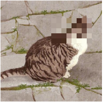

# z-mosaic
A react component that create a mosaic on an image.

## Install

```shell
npm install z-mosaic --save
```

## Usage
Make sure that you have a parent block with specific width to wrap this component, or you will get a component with fullscreen width.

```js
import React from "react";
import ReactDOM from "react-dom";
import ZMosaic from "z-mosaic";
const neko = "https://avatars0.githubusercontent.com/u/18083507?s=460&v=4";

ReactDOM.render(
  <div style={{ width: 200, height: 200 }}>
    <ZMosaic src={neko} width={80} height={50} top={35} left={100} />
  </div>,
  document.getElementById("app")
);
```

## Demo


## Api
### props

|   name    |  type  | default |              description              |
| :-------: | :----: | :-----: | :-----------------------------------: |
|    src    | string |   ""    | The image you want to generate mosaic |
|   width   | number |    0    |            Mosaic's width             |
|  height   | number |    0    |            Mosaic's height            |
|    top    | number |    0    |           Mosaic's position           |
|   left    | number |    0    |           Mosaic's position           |
| className | string |   ""    |       Custom style's classname        |

